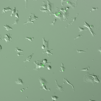

# Ferroptosis occurs through an osmotic mechanism and propagates independently of cell rupture

**This repository includes python source code and one test dataset.**

- Input: path to XYT csv file , containing for each cell (row) three columns: xy position and time of death (see sample data).
- Output: 
  * ```mean_time_death``` - average difference in time of death between neighboring cells. 
  * ```scramble_mean_time_death``` - average different in time of death between pairs of cells in the randomly sampled permutations.
  * ```perm_prob``` - the probability of a randomly sampled permutations to have scramble_mean_time_death < mean_time_death.
  * ```scramble_signficance``` - average different in time of death between pairs of cells in the 95 percentile of the randomly sampled permutations. Experimental values faster than scramble_signficance  imply a p-value < 0.05.
  * ```spatial propagation index``` - (scramble_signficance - mean_time_death)/ scramble_signficance.
  
    In order to better compare the propagative features of different forms of cell death, we devised a new measure termed the spatial   
    propagation index to quantify the contribution of the spatial component to the observed μexpΔt.
    
_____________________________________________________________________________________________________________________________________

*Additional outputs and their descriptions provided [here](https://github.com/assafZaritskyLab/PropagationOfCellDeath/blob/master/AdditionalOutput.md)*


Input
-------

We have enabled two options for running the analysis code, each requires different output:
1. Single experiment mode:
- Input: path to XYT csv file , containing for each cell (row) three columns: xy position and time of death, output path, parameters. 

*Required parameters:* 
  * ```time_frame``` % Temporal resolution :time between acquired frames (minutes).
  * ```cell_line``` % Cell line type tested in the experiment
  * ```treatment``` % Name of the treatment 
  * ```signal_analyzed``` % The signal analyzed in the experiment 
  
Produces output in the provided directory:
   
  * analyze_single_experiment(file_location, output_location, time_frame, cell_line, treatment, signal_analyzed)

2. Batch mode: 
- Input: experiments folder path containing XYT csv file, output path, parameters csv file path. 

Parameters file should include the following columns:
  * ```File Name``` % A file name matching to the name of the experiment file
  * ```Time Interval (min)``` % Temporal resolution:  time between acquired frames (minutes).
  * ```Cell Line``` % Cell line type tested in the experiment
  * ```Treatment``` % Name of the treatment 
  * ```Signal Analyzed``` % The signal analyzed in the experiment 
  
Produces output in the provided directory:
   
  * analyze_several_experiments(file_location,output_location, parameters_location)


Test data
------------

Download sample data folder via the link: [TestData](https://github.com/assafZaritskyLab/PropagationOfCellDeath/blob/master/sample_data.zip)

The folder includes: 
``` datacsv``` folder containing: XTY csv, called ```*experiment_name*.csv```, ```File details.csv``` file containing required parameters set to this data


Output folders
------------

```Results folder```: 

Containing the following-

- ```Experiment name folder```: One folder for each input XYT csv file, named after the experiment’s name. Each folder contains the 'Data' folder which includes a csv file with additional analyzed information (described in ‘AdditionalOutput.md’)
- ```All```: A folder which contains output relevant to all the analyzed experiments. The folder contains the following files:
   * ```data combined.csv``` :  includes the output specified above
   * ```data_features_combined.csv``` : includes additional analyzed information from all the experiments together.
   


Citation 
--------
lease cite the following manuscript when using this code: "Ferroptosis occurs through an osmotic mechanism and propagates independently of cell rupture" (link)

Please contact Assaf Zaritsky, assafzar@gmail.com, or Chen Galed chengaled@gmail.com for any questions / suggestions / bug reports.
